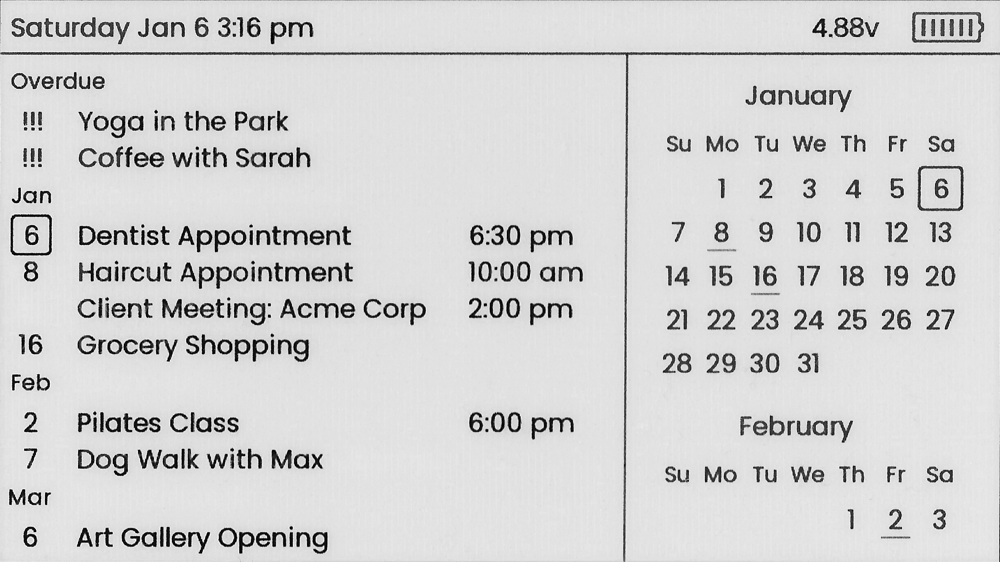

# TickTickDisplay2

> A second rewrite of my [TickTickDisplay](https://github.com/ksmarty/ticktick-display-reborn) for the LilyGo T5-4.7 E-Paper Display



## Setup

Rename `lib/config_example.h` to `lib/config.h` and fill out fields

### Get TickTick UUID

1. Go to https://ticktick.com/signin and login
2. Go to https://www.ticktick.com/webapp/#settings/subscribe
3. Under `Subscribe TickTick in your calendar app`, click `Enable the URL > All Lists`
4. You will be given a link in the following format: `webcal://ticktick.com/pub/calendar/feeds/YOUR_UUID/basic.ics`

### Required Libraries

-   [LilyGo-EPD47](https://github.com/Xinyuan-LilyGO/LilyGo-EPD47)
-   [ArduinoJson](https://arduinojson.org/v6/doc/installation/)
-   [ezTime](https://github.com/ropg/ezTime)

## Convert images to header files

```
find images -type f \( -iname "*.png" -o -iname "*.jpg" -o -iname "*.jpeg" \) -exec sh -c 'python scrips/imgconvert.py -i "$0" -n "$(basename "$0" | cut -f1 -d".")" -o lib/images/"$(basename "$0" | cut -f1 -d".")".h -f' {} \;
```

## Attribution

Weather icons via https://tabler-icons.io/
